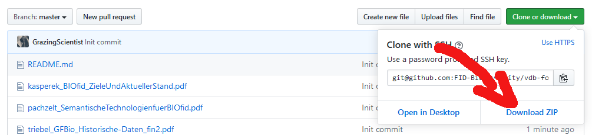

# Folien der VDB-Weiterbildung

Hier finden Sie die Folien zu den Präsentationen bei der Fortbildungsveranstaltung für Fachreferenten und Fachreferentinnen der Biologie (03.-04.03.2020) in Frankfurt am Main, soweit diese durch die Referierenden bereitgestellt werden können. Die Dateien sind für einen begrenzten Zeitraum hier verfügbar (voraussichtlich bis Juni 2020).

## ZIP-Download
Sie können alle Dateien einfach in einer Zip-Datei herunterladen. Dazu klicken Sie einfach auf den grünen Download-Button.

Anschließend klicken Sie auf "Download ZIP".

